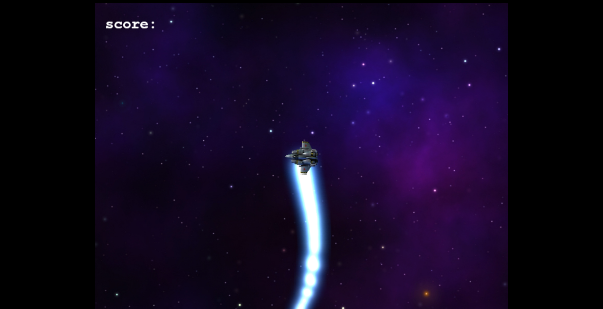
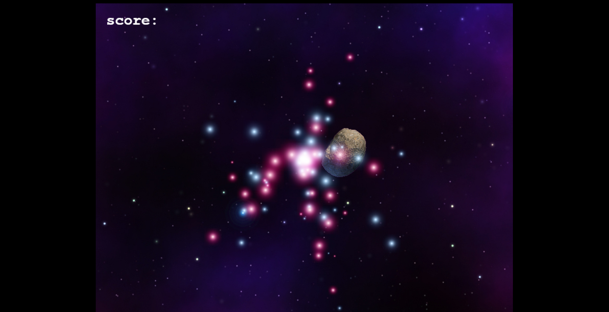

# Surviving Space - A Game built with Phaser 3

> An arcade game built with the Phaser 3 Library for game development about a lone survivor that's trying to get home but gets caught in an asteroid belt, compete to survive and get the highest score in the Hall Of Fame,  only the best of the best will be featured in there.

## Requirements

- [Node.js](https://nodejs.org) is required to install dependencies and run scripts via `npm`.
- A modern [Web Browser](https://google.com) is required to play the game.
- An [internet connection]() is necessary to access to the high score hall of fame and to save your score automatically.

## Built With

- Javascript
- Local Storage
- Webpack
- Phaser 3
- Jest

## Live Demo

You can visit [here](https://alexisbec.github.io/JS-ToDoList/) our app.

## Getting Started

###Clone The Repository from

>git clone https://github.com/GabrielJSuarez/Space-Shooter-Phaser3.git 

### Run these commands in order

| Command | Description |
|---------|-------------|
| `npm install` | Install project dependencies |
| `npm start` | Build project and open web server running project |
| `npm run build` | Builds code bundle with production settings (minification, uglification, etc..) |
| `npm test` | Run the Jest test suite |

## Game Controls

- Control your ship with directional arrows (up, left, right);
- Fire from your ship by pressing the space key;

## Design Documentation

Read the [Design Documment]()

## Authors

👤 **Gabriel Suarez**
- Github: [@ginnandjuice](https://github.com/ginnandjuice)
- Twitter: [@fatbaxxter](https://twitter.com/fatbaxxter)
- Linkedin: [Gabriel Suárez](https://www.linkedin.com/in/gabriel-ginn-suarez/)

## 🤝 Contributing

Contributions, issues, and feature requests are welcome!

## Show your support

Give a ⭐️ if you like this project!

## 📝 License

This project is [MIT](https://github.com/alexisbec/JS-ToDoList/blob/development/LICENSE) licensed.

## External Assets Used

- Phaser 3 Library assets for images, sounds and soundtracks
- Inspiration from [The Space Shooter Game](https://learn.yorkcs.com/category/tutorials/gamedev/phaser-3/build-a-space-shooter-with-phaser-3/)
- Phaser 3 Documentation and working examples library for the visual implementations used on the game.